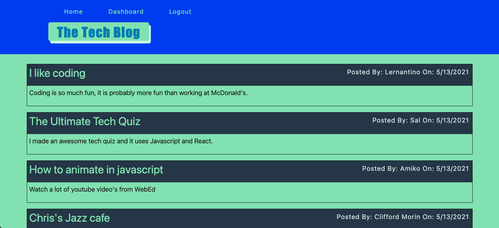
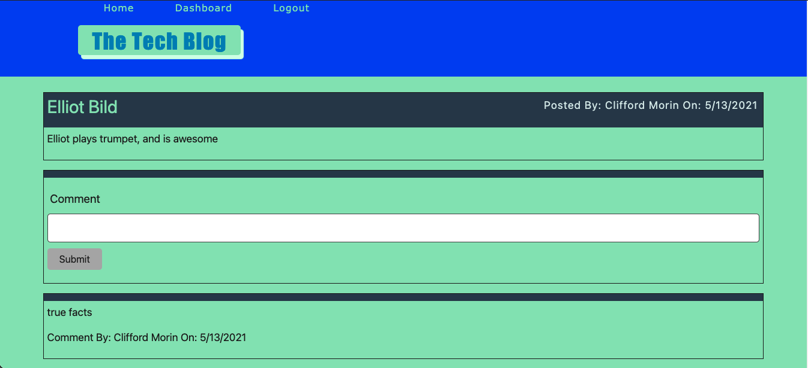
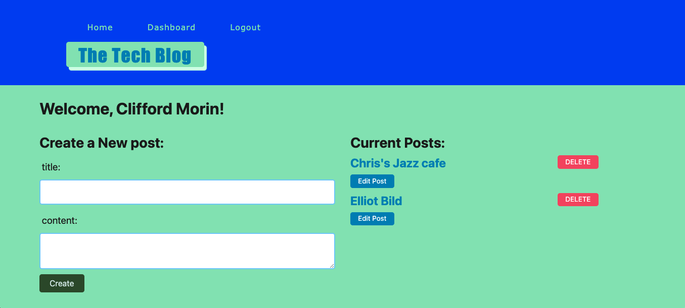

# Tech-blog

[](https://github.com/git/git-scm.com/blob/main/MIT-LICENSE.txt)

## Description

  
* Writing about tech can be just as important as making it. Developers spend plenty of time creating new applications and debugging existing codebases, but most developers also spend at least some of their time reading and writing about technical concepts, recent advancements, and new technologies. A simple Google search for any concept covered in this course returns thousands of think pieces and tutorials from developers of all skill levels!

* Your task this week is to build a CMS-style blog site similar to a Wordpress site, where developers can publish their blog posts and comment on other developers’ posts as well. You’ll build this site completely from scratch and deploy it to Heroku. Your app will follow the MVC paradigm in its architectural structure, using Handlebars.js as the templating language, Sequelize as the ORM, and the express-session npm package for authentication.

* Live Demo: ()

## User Story

```
AS A developer who writes about tech
I WANT a CMS-style blog site
SO THAT I can publish articles, blog posts, and my thoughts and opinions
```

## Table of Contents
  * [Usage](#usage)
  * [Links](#links)
  * [License](#license)
  * [Contributions](#contributions)
  * [Questions](#questions)

## Usage

 
 
 

## Links
 
  * Heroku Deployed demo link: ()
  * Github Repository URL: (https://github.com/CliffordMorin/Tech-blog)

## License

  [](https://github.com/git/git-scm.com/blob/main/MIT-LICENSE.txt)

## Contributions

  Fork, request, or contact me.
  

## Questions

  [](https://github.com/CliffordMorin) 
  [](https://www.linkedin.com/in/morin-clifford-129888a9/)

  Feel free to reach me at cemorin21@gmail.com with any question regarding this project!
  